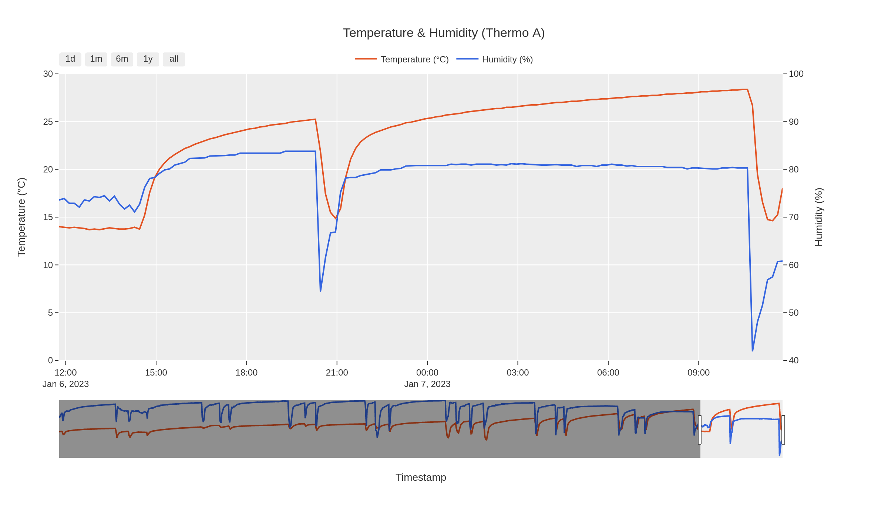

This repository contains a bunch of opinionated data visualizations in Python in the form of Jupyter Notebooks. The code is intended for quicker visualizations when performing an exploratory data analysis.

- [Run a JupyterLab Container](#run-a-jupyterlab-container)
- [Visualizations](#visualizations)
  - [Dual Axis Line Chart](#dual-axis-line-chart)
- [Roadmap](#roadmap)


# Run a JupyterLab Container

To modify and execute notebooks of this repository, you can use the [jupyter/datascience-notebook](https://hub.docker.com/r/jupyter/datascience-notebook) container image from the [Jupyter Docker Stacks](https://jupyter-docker-stacks.readthedocs.io/en/latest/).

Run the following steps with this repository as your working directory:

```
# Build custom image including packages required by out notebooks
docker build -t jupyter-custom:latest ./jupyter-notebook-custom

# Run the container (see container log for URL and access token)
docker run --name jupyter -it --rm -p 8888:8888 -v "${PWD}":/home/jovyan/work jupyter-custom:latest
```

# Visualizations

## [Dual Axis Line Chart](./dual-axis-line-chart/dual-axis-line-chart.ipynb)


# Roadmap
- Warming Stripes
- Calendar View
- Dynamic Histogram Matrix
- Event Timelines
- Violin Plots
- Chandlestick Chart
- State Change Heatmap
- Bar Chart showing resampled mean values for configurable time steps
- Ridge Plot